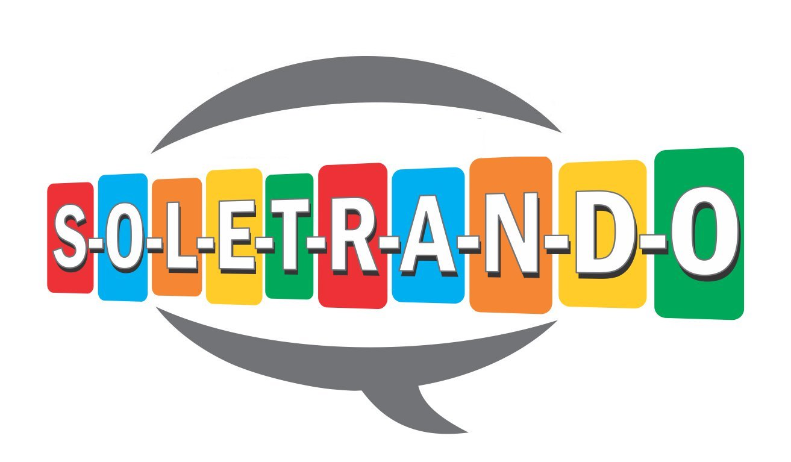

# Soletrando
Ferramenta com uso de API do google tradutor para auxiliar no treino para o campeonato de Soletrando do IFRN Campus Apodi (realizado nas linguas portuguesa, espanhola e inglesa).
Desenvolvido em 2019.

